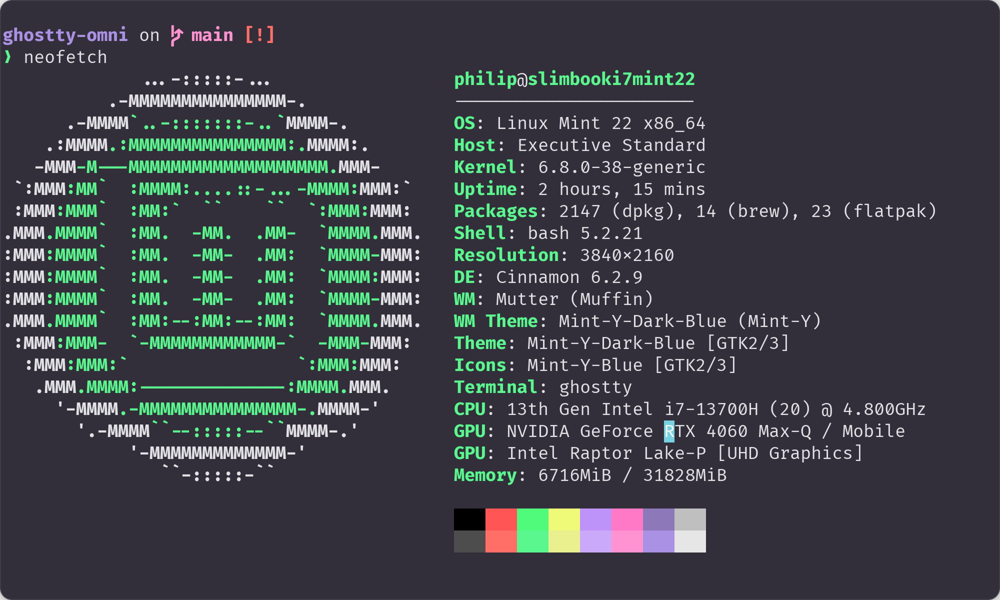

<h1 align="center">
   
  
   
  Omni for <a href="https://ghostty.org">Ghostty</a>
   
</h1>

  <strong>Dark theme for <a href="https://ghostty.org">Ghostty</a></strong>

  

  

  <a href="#install">Install</a> •
  <a href="#team">Team</a> •
  <a href="#license">License</a>

  

## Install

All instructions can be found at [INSTALL.md](./INSTALL.md).

## Team

This Omni theme was ported to Ghostty terminal using [SavingFrame's](https://github.com/SavingFrame) Python script from here: https://github.com/ghostty-org/ghostty/discussions/4761

This theme is maintained by the following person(s) and other contributors.

|  |
| ------------------------------------------------------------------------------------------------ |
| [Philip Brocoum](https://github.com/stedwick)                                                   |

## License

[MIT License](./LICENSE.md)
